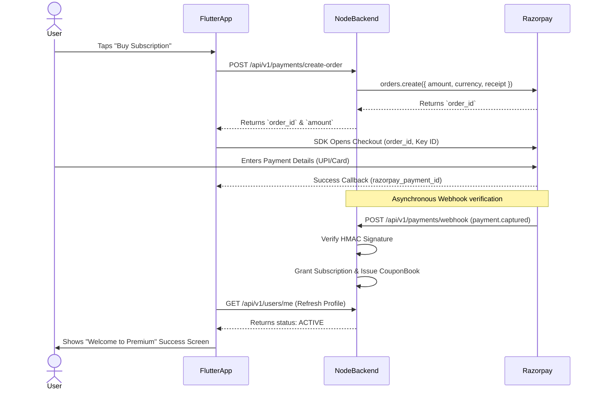

# Razorpay Integration & Implementation Plan

This document outlines the end-to-end architecture and implementation steps to integrate Razorpay securely between the Flutter Customer App (`CouponApp/CouponCustomer`) and the Node.js Backend (`CouponApp/CouponAPI`).

---

## 🏗️ 1. Architecture Flow Overview

The secure payment cycle requires coordination between both the Backend API and the Flutter Client SDK.



---

## 💻 2. Backend Implementation (`CouponApp/CouponAPI`)

The Backend is explicitly responsible for generating the order authorization securely, and validating the final outcome via cryptographically signed webhooks to prevent spoofing.

### Step 1: SDK & Environment Setup
- **Install Package:** `npm install razorpay`
- **Typings:** `npm install -D @types/razorpay`
- **Environment (`.env`):**
  ```env
  RAZORPAY_KEY_ID=rzp_test_xxxxxx
  RAZORPAY_KEY_SECRET=xxxxxxxxxxxxxxxx
  RAZORPAY_WEBHOOK_SECRET=your_secure_webhook_secret
  ```
- **Configuration (`src/config/razorpay.ts`):** Export an initialized `Razorpay` singleton using the env variables.

### Step 2: Orders API Route
- **File:** `src/modules/payments/payments.routes.ts`
- **Method:** `POST /api/v1/payments/create-order`
- **Logic:**
  1. Validate the user is authenticated (via JWT middleware).
  2. Optional: Check if the user already has an active subscription.
  3. Look up real-time pricing from `AppSetting` (e.g. ₹1000).
  4. Call `razorpay.orders.create({ amount: 1000 * 100, currency: "INR" })` (Amount is required in the smallest currency sub-unit: *Paise*).
  5. Respond to the client with the resulting `order_id`.

### Step 3: Secure Webhook Event Target
- **Route:** `POST /api/v1/payments/webhook`
- **Crucial Note:** This route **CANNOT** use standard `express.json()`. It requires the **Raw Buffer Body** so that we can accurately compute the hash. Add a targeted middleware specifically here parsing `express.raw({ type: 'application/json' })`.
- **Validation Middleware (`razorpayWebhook.middleware.ts`):**
  Uses the raw body to compute the `HMAC SHA256` signature using `RAZORPAY_WEBHOOK_SECRET` and matches it identically against the provided `x-razorpay-signature` header.

### Step 4: Core Fulfillment Transaction (`payments.service.ts`)
Once validation passes and event type is `payment.captured`:
1. Use `prisma.$transaction` for absolute atomicity.
2. Check if a `Subscription` with the webhook's `razorpayPaymentId` already exists (Idempotent execution).
3. Insert `Subscription` record mapped to `userId`.
4. Run a `findMany` across `Coupon` for all `isBaseCoupon = true` available in the user's `cityId`.
5. Allocate the `CouponBook` linked to the subscription interval.
6. Push a `createMany` sequence over `UserCoupon` bridging limits mapping out the base coupons.
7. Record an `EARNED` event in `WalletTransaction` to bestow default platform coins (`User.coinBalance` incremented).

---

## 📱 3. Flutter Implementation (`CouponApp/CouponCustomer`)

The Flutter application orchestrates the visual journey. Since the project uses **Riverpod** & **Dio**, we must neatly separate the Payment API integration from the UI logic.

### Step 1: Dependency Validation
Ensure the `razorpay_flutter: ^1.3.6` package is properly installed via pubspec.

### Step 2: Payment Repository layer (`lib/features/payment/data/payment_repository.dart`)
- Create methods mapping to the custom endpoints crafted above.
  - `Future<Either<Failure, String>> createOrder()`
    - **Logic:** Invokes Dio on `POST /api/v1/payments/create-order`.
    - Returns the securely assigned `order_id`.

### Step 3: Razorpay Service Class (`lib/core/services/razorpay_service.dart`)
- **Initialize Razorpay**: Register the event listener callbacks inside `initState()` or a dedicated constructor depending on the lifecycle.
  ```dart
  _razorpay = Razorpay();
  _razorpay.on(Razorpay.EVENT_PAYMENT_SUCCESS, _handlePaymentSuccess);
  _razorpay.on(Razorpay.EVENT_PAYMENT_ERROR, _handlePaymentError);
  _razorpay.on(Razorpay.EVENT_EXTERNAL_WALLET, _handleExternalWallet);
  ```
- **Method `openCheckout(String orderId, int amount)`**:
  - Puts together the options map.
  ```dart
  var options = {
    'key': Env.razorpayKeyId, // Expose only Public Key to Flutter
    'amount': amount, // in paise
    'name': 'CouponApp Premium',
    'order_id': orderId,
    'prefill': {
      'contact': userState.phone,
      'email': userState.email
    }
  };
  _razorpay.open(options);
  ```

### Step 4: State Management (`lib/features/payment/presentation/payment_controller.dart`)
- **Riverpod Setup**: Create an `AsyncNotifier` named `PaymentController`.
- **Initiate Flow (`startPaymentFlow`)**:
  1. Triggers `.createOrder()` from repository.
  2. Receives valid `order_id`.
  3. Triggers `RazorpayService.openCheckout()`.
- **Handling UI Success State**:
  - The `_handlePaymentSuccess` callback will be invoked natively by Razorpay SDK when the interaction finalizes.
  - The Controller dictates an event altering state to "Verifying..." indicating that the callback succeeded natively.
  - Make a REST API call forcing the `ProfileController` to reload (`GET /api/v1/users/me`).
  - Validate that the endpoint successfully fetched a non-null `subscription` block.
  - Fire `context.go('/subscription-success')` to render the celebratory animations.
- **Cleanup**: ALWAYS invoke `_razorpay.clear()` when disposing of the service class so listeners don't leak.
